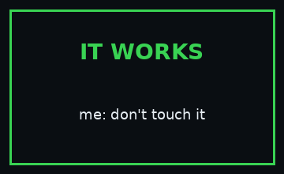

 

<table>
<tr>
<td width="48%" align="center">

</td>
<td width="48%" align="center">

</td>
</tr>
</table>

 

<a href="https://www.linkedin.com/in/nikhil-bhatt-485046295/">LinkedIn</a>
&nbsp; • &nbsp;
<a href="https://github.com/NikhilBhatt-dev">GitHub</a>
&nbsp; • &nbsp;
<a href="mailto:bhattnikhil158@gmail.com">Email</a>

---

## 👋 Hey, I'm Nikhil

Frontend-focused developer building **MERN, TypeScript and real-time collaboration projects**. Currently sharpening **DSA + full-stack development** and exploring systems like **CRDTs**.

### 🚀 What I build

- ⚛️ React / Next.js interfaces
- 🟢 Node.js / Express backends
- 🍃 MongoDB + REST APIs
- 🔄 Real-time collaboration with CRDT concepts
- 🧠 DSA and problem solving

### 🛠️ Stack

`HTML` `CSS` `JavaScript` `TypeScript` `React` `Next.js` `Tailwind` `Node.js` `Express` `MongoDB` `Git`

⭐ Thanks for visiting — and yes, the profile art is intentionally a little terminal-ish.

